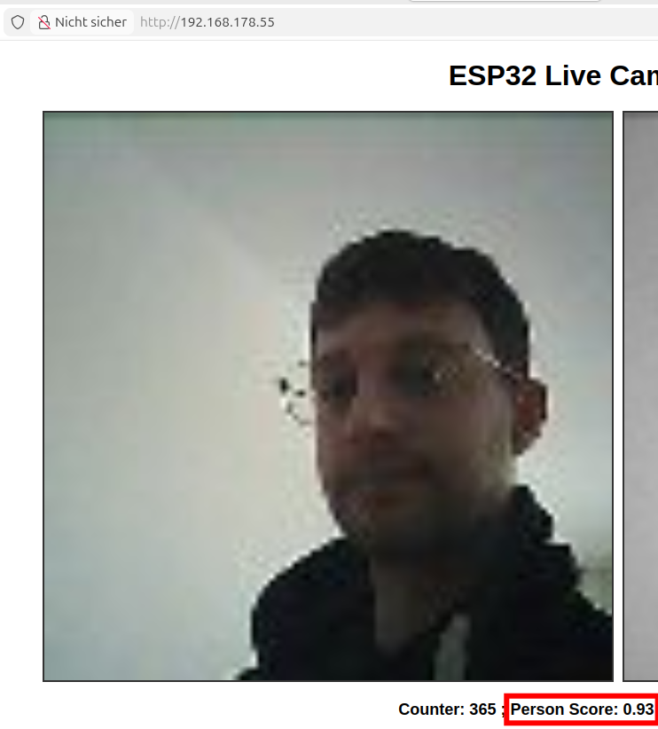
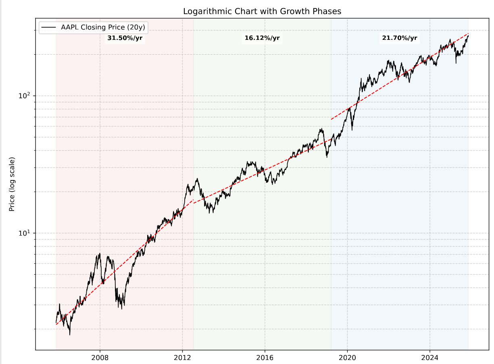
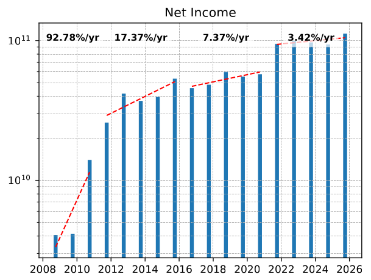
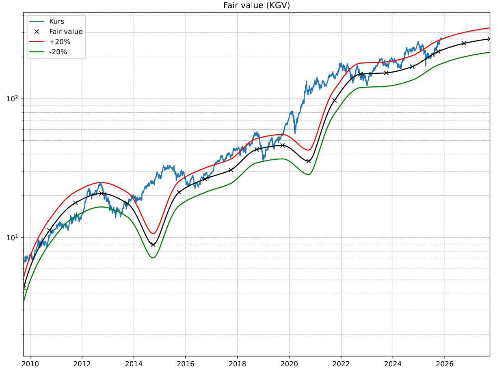

## 👋 Hi, I'm Stefan Schlee

**Mechatronics Engineer** | **Embedded Software 💻** | **Robotics and Control 🤖**

I'm passionate about building robust embedded systems and intelligent control architectures. My work bridges low-level firmware and high-level algorithm development — from real-time embedded C/C++ systems to model-based design with Simulink.

---

You can also find me on [LinkedIn](https://www.linkedin.com/in/stefan-schlee-9b67aa227/)  
Feel free to explore my projects below — many of them are inspired by my academic and professional journey!

## 🗂️ Projects Overview

### 📂 ESP32-S3 Edge AI Person Detection

This project implements real-time person detection on an ESP32-S3 with a camera module using **TensorFlow Lite Micro**. It explores how CNN-based vision models can run efficiently on constrained edge devices.

The ESP32-S3’s dual-core architecture is used to split the workload:

- **Core 1:** Handles image capture, preprocessing, inference, and writes results to a shared double buffer.  
- **Core 2:** Runs a lightweight web server that streams live images and displays detection results.

This setup enables smooth visualization while keeping the inference pipeline running continuously.

  
  

#### 🔗 Related Repositories
[ESP32-S3 AI Project](https://github.com/StefanSchlee/placeholder-repo)

---

### 📂 Quadcopter Flight Controller (ESP32-Based)

During my bachelor’s studies, I built a custom quadcopter from scratch and developed a flight controller firmware running on an ESP32. The controller received inputs from an RC receiver, fused IMU sensor data using a Kalman filter to estimate the current flight attitude, and applied a cascaded PID controller to compute motor setpoints. These were output as PWM signals to control four brushless motors. Additional sensors included a GPS receiver and barometer for extended navigation data. The system also streamed real-time telemetry via Bluetooth to a PC for monitoring and analysis.

> ⚠️ **Note:** This project was developed early in my academic journey. From today's perspective, the code quality and software architecture are no longer up to my current standards.

  

#### 🔗 Related Repositories

| Repository                                                                        | Description                                            |
| --------------------------------------------------------------------------------- | ------------------------------------------------------ |
| [Quadcopter Firmware](https://github.com/StefanSchlee/Quadrokopter_V2)            | This is the main repository for the firmware           |
| [MPU9250_SPI](https://github.com/StefanSchlee/MPU9250_SPI)                        | Driver for the MPU9250 inertial measurement unit (IMU) |
| [IMU Kalman Filter](https://github.com/StefanSchlee/IMU_KalmanFilter/tree/master) | Kalman filter for state estimation                     |
| [Digital Filter Lib](https://github.com/StefanSchlee/DigitalFilter/tree/master)   | Library with digital filters                           |

---
### 📁 Python Stock Analysis

This project is inspired by existing investor tools (for example, [Aktienfinder](https://aktienfinder.net) and [Eulerpool](https://eulerpool.com)) that visualize price charts and fundamental data using intuitive plots. The goal is to help investors quickly assess whether a stock appears undervalued based on the available data.

I started this project because I was frequently unsatisfied with available tools — no single website provided all the features I wanted, and some useful features were hidden behind paywalls. For example, logarithmic plots of price and fundamental data are rarely available together.

  

  
  

#### 🔗 Repository
[Stock Analysis](https://github.com/StefanSchlee/Stock-analysis)

---
### 📁 Python Package Demo

This repository is a minimal example of how to structure and test a Python package that is installable via `pip` (locally, not yet published to PyPI). It demonstrates best practices for packaging, unit testing, and continuous integration — ideal for learning or teaching the Python packaging workflow.

The demo package includes a single module with a simple `square(x)` function as its core logic.

**Key Features:**
- 📁 Structured as an installable Python package (`pip install .`)
- ✅ Unit tests written using `pytest`, run in isolated environments using `tox`
- 🔄 Automated test execution via **GitHub Actions** CI

#### 🔗 Repository
[Python_Testing_Demo](https://github.com/StefanSchlee/Python_Testing_CI_Demo/blob/master/src/MyPackage/MyModule.py)
